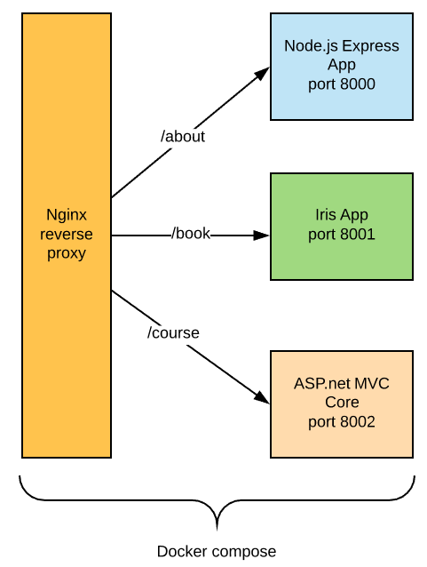

# Ví dụ về hệ thống Microservice

Hệ thống sẽ gồm có các container như sau:
1. Nginx đóng vai trò reverse proxy: thầy Cường
2. Node app cổng 8000 kết nối vào CSDL Mongo DB: cô Linh
3. Golang app cổng 8001 kết nối vào CSDL Postgresql: chú Long
4. ASP.net MVC Core cổng 8002 kết nối vào CSDL Microsoft SQL Server 2017: thầy Huy



## Cấu trúc thư mục
```
Git Repo
   +
   |
   +---+nginx
   |
   +---+node
   |
   +---+go
   |
   +---+net
   |
   +---+documents
   |
   +---+docker-compose.yml
```